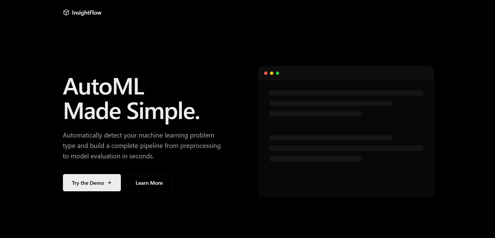

# InsightFlow



<a href="https://drive.google.com/file/d/12LlCfqOjHMuhBiwUochYJGcuOKw55Rsf/view?usp=sharing" target="_blank">
  
</a>

InsightFlow is a Streamlit-based AutoML application that automatically detects the problem type (Classification, Regression, Time Series, or Unsupervised Learning) and builds a complete machine learning pipeline for it — from preprocessing and feature selection to training and evaluation.

---

## 🚀 Features

* 📂 Upload any tabular CSV dataset
* 🔍 Auto-detects ML problem type
* 🧼 Intelligent preprocessing (handling missing values, encoding, scaling)
* 📊 Exploratory Data Analysis (EDA) with visualizations
* 🧠 Feature selection (statistical or model-based)
* 🤖 Model training & evaluation
* 🧪 Interactive predictions through Streamlit UI

---

## 📁 Project Structure

```
├── run.py                   # Unified runner for all services
├── api.py                   # FastAPI backend
├── app.py                   # Streamlit app UI logic
├── main.py                  # Core pipeline logic
├── landing-page/            # React frontend (Vite)
├── prob_type.py             # Problem type detection logic
├── preprocess.py            # Preprocessing logic for all problem types
├── model_training.py        # Model training and evaluation
├── eda_utils.py             # EDA utilities (correlation matrix, stats)
├── feature_selection.py     # Feature selection methods
```

---

## 📊 Supported Problem Types

* **Classification** (e.g., predicting categories)
* **Regression** (e.g., predicting continuous values)
* **Time Series Forecasting** (based on lag features)
* **Unsupervised Learning** (KMeans Clustering + Silhouette Score)

---

## 🔧 How It Works

1. Upload a CSV dataset
2. Select the target column (or leave blank for unsupervised)
3. InsightFlow:

   * Detects the problem type
   * Applies the correct preprocessing steps
   * Runs feature selection
   * Trains and evaluates a suitable model
4. View EDA, metrics, and test predictions interactively

---

## 📦 Dependencies

* Python 3.9+
* Node.js (for the React frontend)
* Streamlit, FastAPI, Uvicorn
* Pandas, NumPy, Scikit-learn
* Seaborn, Matplotlib

Install Python dependencies via:

```bash
pip install -r requirements.txt
```

Install frontend dependencies:
```bash
cd landing-page
npm install
cd ..
```

---

## 🧪 Example Usage

You can run all three services (React Frontend, FastAPI Backend, Streamlit App) simultaneously using the unified runner:

```bash
python run.py
```

This will start:
* **Landing Page**: http://localhost:5173
* **FastAPI Backend**: http://localhost:8000
* **Streamlit App**: http://localhost:8501

Upload your CSV, select the target column, and let InsightFlow do the rest.

---

## 🔮 Future Improvements

* Add support for hyperparameter tuning (GridSearch, Optuna)
* Model variety: XGBoost, LightGBM, LSTM for time series
* Model explainability using SHAP or LIME
* Enhanced UI for result visualizations

---

